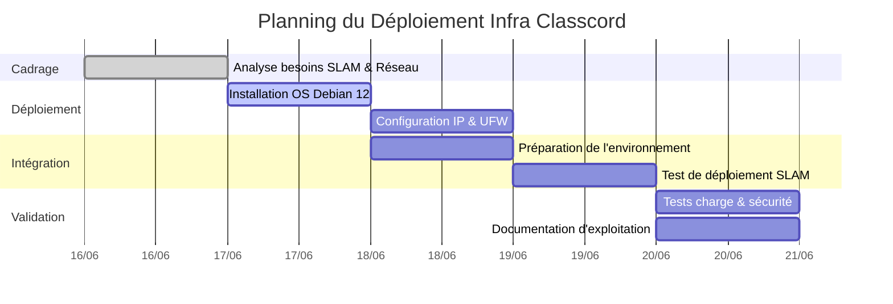

# RP02 - Infrastructure Serveur Classcord

> **Auteur :** Edib Saoud
> **Date :** 06/2025
> **Contexte :** Projet inter-spécialités (BTS SIO SISR/SLAM) - IRIS Mediaschool

## 1. Contexte du Projet

Dans le cadre d'un projet de fin d'année, l'équipe de développement (SLAM) avait besoin d'une infrastructure réseau et système fiable pour déployer l'application de messagerie interne **Classcord**.

L'objectif (SISR) était de concevoir, déployer et sécuriser un serveur dédié pour héberger le backend et la base de données, tout en garantissant une haute disponibilité et une isolation des flux sur le réseau pédagogique du campus.

## 2. Sommaire de la Documentation

1. [Dossier de Choix Technique](01_DOSSIER_CHOIX_TECHNIQUE.md) : Analyse des besoins et choix d'architecture (Debian, UFW).
2. [Procédure d'Installation](02_PROCEDURE_INSTALLATION.md) : Déploiement système, configuration réseau et durcissement.
3. [Mode Opératoire](03_MODE_OPERATOIRE.md) : Guide d'exploitation et de supervision (CLI).
4. [Cahier de Recette](04_CAHIER_DE_RECETTE.md) : Tableau de validation des tests d'infrastructure et de sécurité.

## 3. Compétences SISR Mobilisées (Blocs BTS SIO)

| Bloc de Compétences | Compétences spécifiques validées dans ce projet | Preuves / Exemples concrets |
|:---|:---|:---|
| **Bloc 1 : Support et mise à disposition de services informatiques** | **Gérer le patrimoine informatique** | Déploiement matériel virtuel et système Linux Debian. Paramétrage réseau (IP statique). |
| | **Travailler en mode projet** | Coordination avec les développeurs (SLAM) en méthode Agile. Respect des contraintes de livraison. |
| | **Mettre à disposition un service informatique** | Installation et configuration d'un environnement d'hébergement web complet et de base de données. |
| **Bloc 3 : Cybersécurité des services informatiques** | **Protéger l'infrastructure de l'organisation** | Durcissement de l'OS, configuration d'un pare-feu local (UFW) et sécurisation SSH. |

## 4. Planning de Réalisation (Diagramme de Gantt)

Le projet s'est déroulé sur une période intensive de 5 jours en mode itératif (Sprint) :

